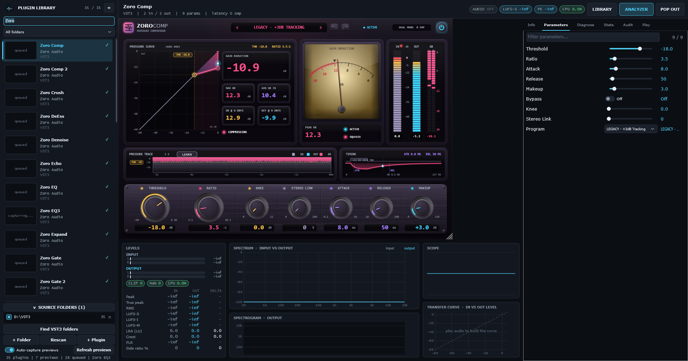
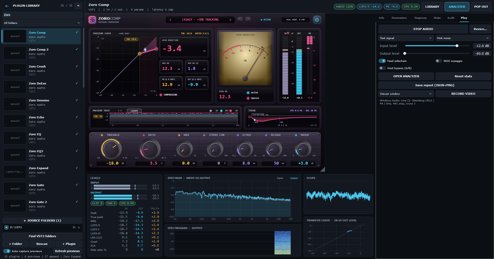

# Zoro VST Viewer 2.5.0 for Windows x64

Zoro VST Viewer is a Windows VST3 host and analysis toolkit. It lets you browse a local plugin library, open a plugin in the hosted editor, inspect its parameters, and view audio measurements while running test audio.

## See the viewer in use

The short walkthrough and screenshots below show the **viewer application**: its plugin library, hosted editor, parameter panel, and live analyzer. The analyzer example uses the built-in pink-noise test signal with output set to -60 dB.

<video src="demo/viewer-tour.mp4" controls width="100%"></video>

[Download or play the 8-second viewer walkthrough](demo/viewer-tour.mp4)

### Plugin library and hosted editor

### Live analyzer

## Downloads

- [Windows x64 installer](ZoroVSTViewer-2.5.0-Setup-win64.exe)
- [Windows x64 portable build](ZoroVSTViewer-2.5.0-win64-portable.zip)
- SHA-256 checksums: [SHA256SUMS.txt](SHA256SUMS.txt)

The installer includes the Microsoft Visual C++ runtime prerequisite. The portable archive contains the application and runtime installer.

This public distribution contains application binaries, documentation, and viewer screenshots/video only. It does not include project source code or VST3 plugin bundles.
